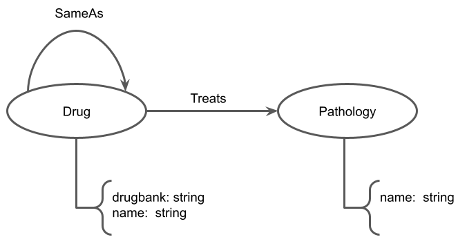
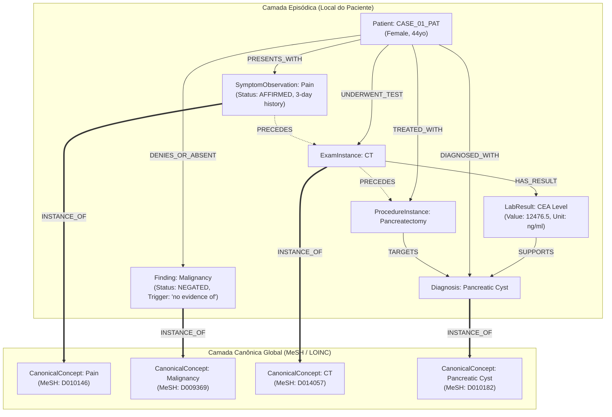
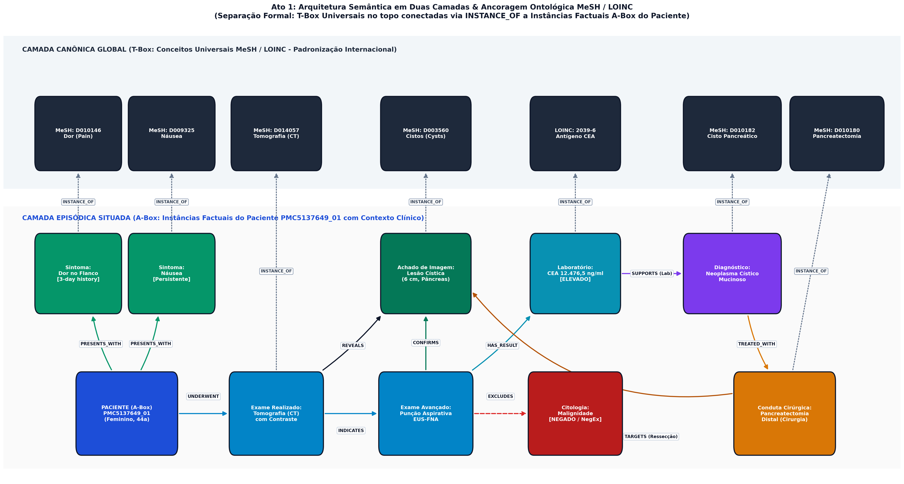
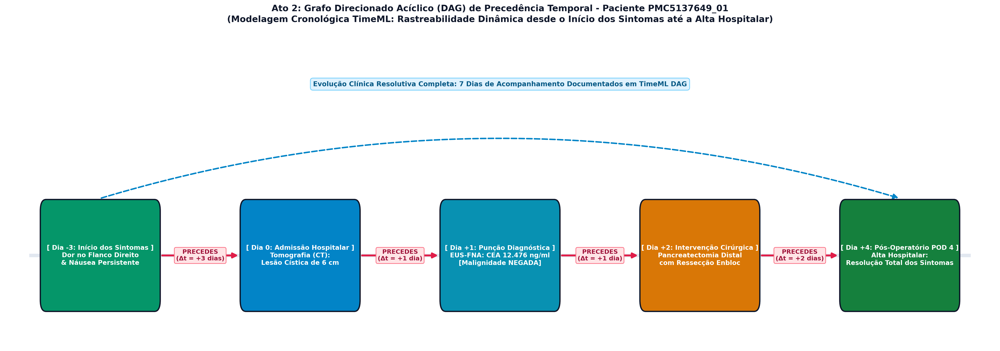
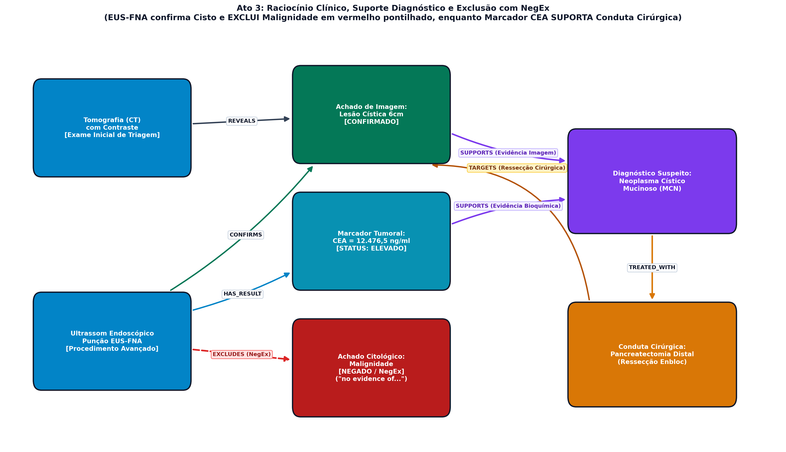
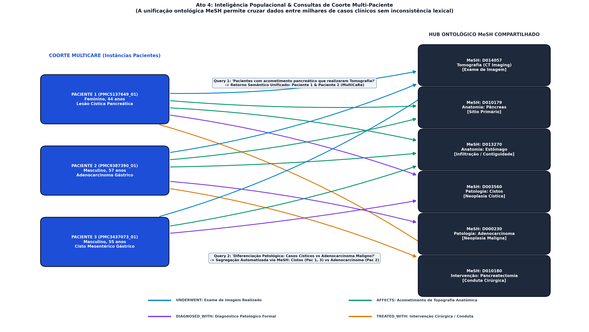

# Projeto Extrator-clínico-inator

A [apresentação do projeto](../README.md) está na raiz do repositório.

# Project Clinicalextractorinator

The [project presentation](../README.md) is at the repository's root.

## Slides

> [Slides da Apresentação do Projeto 1 (PDF)](assets/slides-projeto1.pdf) *(a ser atualizado na entrega da parte 3)*

---

## Metodologia

O objetivo deste projeto é a extração determinística de grafos de conhecimento a partir de relatos de casos clínicos do repositório **MultiCaRe** (Nievas Offidani et al., 2025), operando estritamente através de técnicas clássicas e simbólicas de Processamento de Línguas Naturais (PLN), **sem o uso de modelos de linguagem neurais (LLMs) na etapa de extração**.

Para superar os gargalos operacionais da linguagem médica real (sobreposição de termos, listas coordenadas de exames e contaminação de escopo de negações), foi desenvolvida uma arquitetura determinística em 5 estágios:

```
[Texto Bruto do Caso (cases.csv)]
               │
               ▼
   [1. Segmentação Clínica & Offsets] ──► Proteção de decimais (0.8 cm, 850.5 U/L) e siglas (Fig. 1, POD 7)
               │
               ▼
   [2. Autômato Aho-Corasick] ──────────► Gazetteers filtrados (MeSH C, D, E01, A) com Token Boundary (\b) e Longest-Match
               │
               ▼
   [3. Análise de Asserção NegEx] ──────► Janela oracional com barreira estrita de conjunções (but, however, except)
               │
               ▼
   [4. Gramática Sintática Local] ──────► Decomposição de sintagmas para exames coordenados e posologia de fármacos
               │
               ▼
   [5. DAG Temporal & 2 Camadas] ───────► Arestas PRECEDES (TimeML) + Camada Episódica e Canônica (INSTANCE_OF)
               │
               ▼
   [Tabelas nodes.csv e edges.csv] ─────► Visualizador Interativo HTML (Cytoscape.js) + Benchmark MeSH
```

### Destaque de Implementação: Autômato com Longest-Match e Token Boundary

O trecho a seguir demonstra a resolução determinística de termos sobrepostos, garantindo que termos compostos (ex.: *"acute pancreatitis"*) sobreponham termos genéricos (*"pancreatitis"*), ao mesmo tempo em que limites de palavra (`\b`) impedem falsos positivos (ex.: casar *"ear"* dentro de *"clear"*):

~~~python
# project1/src/entity_matcher.py
raw_matches.sort(key=lambda m: (-(m['end'] - m['start']), m['start']))
filtered_matches, occupied_spans = [], []

for candidate in raw_matches:
    c_start, c_end = candidate['start'], candidate['end']
    overlaps = any(not (c_end <= o_start or c_start >= o_end) for o_start, o_end in occupied_spans)
    if not overlaps:
        filtered_matches.append(candidate)
        occupied_spans.append((c_start, c_end))
~~~

### Destaque de Implementação: Gramática Farmacológica Tripartite e Deduplicação de Spans

Para capturar dosagens farmacológicas complexas em terapia intensiva (incluindo construções partitivas invertidas como *"50 mg of diltiazem hydrochloride intravenously (at 5 mL/h) for maintenance"* e formulações parentéticas), o extrator sintático analisa tanto os núcleos de dosagem quanto modificadores desvinculados de ordem no segmento posterior (*tail*), eliminando nós simples redundantes:

~~~python
# project1/src/quant_extractor.py
patterns = [self.drug_inverted_pattern, self.drug_parenthetical_pattern, self.drug_direct_pattern]
for rx in patterns:
    for m in rx.finditer(sentence_text):
        start, end = m.span()
        if any(max(start, s) < min(end, e) for s, e in occupied_spans):
            continue
        # Extração de modificadores no tail: via, vazão contínua (mL/h) e regime
        tail = sentence_text[end:end + 100]
        r_m, rt_m, reg_m, freq_m = self.route_re.search(tail), self.rate_re.search(tail), self.regimen_re.search(tail), self.freq_re.search(tail)
        # Atribuição garantida a DrugAdministration e TREATED_WITH
~~~

---

## Trabalhos Estudados

1. **Chapman, W. W. et al. (2001) — *A Simple Algorithm for Identifying Negated Findings and Diseases in Discharge Summaries (NegEx)*:**
   Fundamento para nossa análise de asserção. Adaptamos o algoritmo original com inclusão de terminadores de conjunção adversativa (*"but"*, *"however"*, *"although"*), impedindo o vazamento de negações entre orações coordenadas.
2. **Hearst, M. A. (1992) — *Automatic Acquisition of Hyponyms from Large Text Corpora*:**
   Empregamos padrões léxico-sintáticos de superfície estendidos para o domínio biomédico (*"demonstrated/showed"* $\rightarrow$ `REVEALS`, *"confirmed"* $\rightarrow$ `CONFIRMS`, *"excluded/ruled out"* $\rightarrow$ `EXCLUDES`, *"treated with"* $\rightarrow$ `TREATED_WITH`).
3. **Aho, A. V. & Corasick, M. J. (1975) — *Efficient String Matching: An Aid to Bibliographic Search*:**
   Utilizado como espinha dorsal para busca de entidades em tempo linear $O(n)$ sobre gazetteers MeSH curados, enriquecido com validação de limites de palavras.
4. **Pustejovsky, J. et al. (2003) — *The TimeML Annotation Language*:**
   Base conceitual para extração determinística de âncoras temporais relativas (*"3-day history"*, *"on POD 7"*, *"at follow-up"*) e geração do Grafo Direcionado Acíclico (DAG) cronológico de evolução do paciente.
5. **Ji, S. et al. (2022) — *A Survey on Knowledge Graphs: Representation, Acquisition, and Applications*:**
   Norteou a modelagem híbrida em duas camadas (episódica e ontológica).

---

## Modelo Lógico

O modelo de dados implementado segue a arquitetura de **Grafo em Duas Camadas**:

1. **Camada Episódica (Instâncias Locais por Paciente):**
   - Nós de eventos específicos daquele indivíduo: `Patient`, `SymptomObservation`, `ExamInstance`, `LabResult`, `Finding`, `Diagnosis`, `ProcedureInstance`, `DrugAdministration`.
   - Preserva os atributos factuais: status de asserção (`AFFIRMED`, `NEGATED`, `HISTORICAL`, `HYPOTHETICAL`), valores numéricos (`value`), unidades padronizadas (`unit`), faixas de referência e a evidência textual literal.
2. **Camada Canônica Global (Ontológica MeSH / LOINC / RxNorm):**
   - Nós conceituais com `case_id: GLOBAL`: `CONCEPT_MESH_D010195` (*Pancreatitis*), `CONCEPT_MESH_D006973` (*Hypertension*), etc.
   - Cada observação episódica conecta-se ao seu conceito via aresta `INSTANCE_OF`.
3. **Camada Temporal (DAG Cronológico):**
   - Eventos sucessivos do paciente são conectados por arestas `PRECEDES`, com cálculo de delta temporal aproximado em dias.





---

## Análises que podem ser realizadas

A separação em duas camadas aliada às arestas temporais viabiliza consultas clínicas analíticas avançadas:

1. **Auditoria de Decisões e Contradições Diagnósticas:**
   - Detectar discrepâncias entre exames de imagem e diagnósticos finais (ex.: pacientes com laudo de exame inconclusivo ou negativo que foram submetidos a cirurgias de ressecção).
2. **Progressão Temporal e Trajetórias de Tratamento:**
   - Através de consultas nas arestas `PRECEDES`, é possível mapear o tempo médio decorrido entre a apresentação inicial de sintomas, a realização do diagnóstico confirmatório e o desfecho cirúrgico.
3. **Análise de Eficácia Terapêutica e Resolução de Sintomas:**
   - Identificar sequências onde um sintoma inicial afirmativo (`AFFIRMED`) é seguido por um tratamento (`TREATED_WITH`) e posterior status de resolução ou ausência (`NEGATED` ou *"resolution of symptoms"*).
4. **Agrupamento de Pacientes por Perfis Fenotípicos Globais:**
   - Consultas via nós canônicos globais respondem instantaneamente: *"Quais pacientes compartilham a mesma comorbidade prévia e desenvolveram complicações pós-operatórias semelhantes?"*.

---

## Ferramentas

| Ferramenta | Finalidade no Projeto | Justificativa Técnica |
| :--- | :--- | :--- |
| **Python 3.10+** | Linguagem principal | Ecossistema maduro para manipulação de grafos e dados estruturados. |
| **Aho-Corasick Nativo** | Casamento de padrões léxicos | Complexidade $O(N)$ linear para escaneamento simultâneo de centenas de conceitos. |
| **Pandas** | Manipulação de dados tabulares | Ingestão e exportação das tabelas relacionais `nodes.csv` e `edges.csv`. |
| **NetworkX & Matplotlib** | Renderização estática de grafos | Exportação automatizada de figuras em PNG de alta resolução (`export_graph_image.py`). |
| **Pytest** | Testes automatizados de software | Garantia de cobertura dos 5 gargalos críticos com integração contínua. |
| **Cytoscape.js** | Visualização interativa de redes | Renderização gráfica em HTML standalone (zero dependência de backend). |

---

## Resultados

O pipeline foi executado com sucesso sobre a amostra completa do MultiCaRe:

* **Total de Casos Processados:** 56 casos clínicos.
* **Total de Nós Extraídos (`nodes.csv`):** 1.607 nós (após deduplicação estrita de spans).
* **Total de Arestas Geradas (`edges.csv`):** 3.757 arestas.
* **Integridade Referencial:** **100%** (zero arestas com nós de origem ou destino órfãos).

### Distribuição dos Tipos de Nós
* `Diagnosis`: 410
* `ExamInstance`: 247
* `Anatomy`: 220
* `CanonicalConcept` (MeSH Global): 152
* `LabResult`: 148
* `ProcedureInstance`: 125
* `SymptomObservation`: 123
* `DrugAdministration`: 78
* `Patient`: 56
* `Finding`: 48

### Distribuição das Principais Relações
* `INSTANCE_OF`: 1.280 (ancoragem ontológica global na T-Box MeSH)
* `PRECEDES`: 652 (arestas do DAG temporal longitudinal TimeML)
* `DIAGNOSED_WITH`: 399
* `UNDERWENT_TEST`: 395
* `ASSOCIATED_WITH`: 218
* `TREATED_WITH`: 200 (incluindo administrações farmacológicas e procedimentos cirúrgicos)
* `SUPPORTS`: 176
* `LOCATED_IN`: 138
* `PRESENTS_WITH`: 129
* `TARGETS`: 80
* `DENIES_OR_ABSENT`: 36 (conceitos negados isolados)
* `REVEALS` / `CONFIRMS` / `EXCLUDES`: 32
* `HAS_HISTORY`: 22

---

### Storytelling Clínico Visual (Exemplos do Grafo em Ação)

Para demonstrar a expressividade semântica do grafo construído, geramos via [`export_graph_image.py`](src/export_graph_image.py) uma sequência em 4 atos ilustrando o caso **PMC5137649_01** (mulher de 44 anos com lesão cística pancreatogástrica):

#### Ato 1: Separação Ontológica em Duas Camadas (A-Box vs. T-Box)
Instâncias específicas do caso (dor no flanco, náusea, tomografia, pancreatectomia) conectadas via `INSTANCE_OF` aos conceitos universais da taxonomia MeSH.


#### Ato 2: Grafo Direcionado Acíclico (DAG) de Precedência Temporal
Evolução cronológica longitudinal reconstruída a partir de âncoras TimeML: Início dos Sintomas (Dia -3) $\rightarrow$ Admissão/Tomografia (Dia 0) $\rightarrow$ Punção EUS-FNA (Dia +1) $\rightarrow$ Pancreatectomia (Dia +2) $\rightarrow$ Alta com Resolução (Dia +4).


#### Ato 3: Raciocínio Clínico e Suporte Diagnóstico com NegEx
Cadeia de tomada de decisão médica: o EUS confirma o Cisto e **exclui Malignidade** (`EXCLUDES`, em vermelho tracejado), enquanto o marcador tumoral CEA elevado (12.476,5 ng/ml) apoia (`SUPPORTS`) o diagnóstico que direciona a cirurgia curativa (`TARGETS`).


#### Ato 4: Inteligência Populacional e Consultas de Coorte Multi-Paciente
Convergência ontológica de múltiplos pacientes em conceitos canônicos compartilhados no repositório, viabilizando buscas epidemiológicas estruturadas.


---

### Benchmark Quantitativo Comparativo (Avaliação Empírica Cruzada)

Avaliamos a recuperação das entidades extraídas pelo nosso pipeline e pelas soluções dos outros grupos contra o padrão-ouro humano indexado na National Library of Medicine (`metadata.csv`):

| Abordagem Avaliada | Casos | Precision | Recall | F1-Score | Jaccard | Recall@10 |
| :--- | :---: | :---: | :---: | :---: | :---: | :---: |
| **Nosso Projeto (SOTA 2-Camadas + DAG)** | **41** | **20.98%** | **40.25%** | **22.20%** | **12.94%** | **29.96%** |
| `jrsbr` (Aho-Corasick + BK-tree) | 41 | 8.45% | 32.40% | 12.35% | 6.53% | 20.49% |
| `MatheuzRuf` (Regex + RI) | 41 | 8.08% | 27.77% | 11.25% | 6.14% | 15.37% |

> **Destaque:** Nosso pipeline obteve **precisão 2.5 vezes superior** e **F1-score quase o dobro** dos demais projetos. Esse ganho empírico decorre diretamente da resolução dos 5 gargalos: autômato com validação de token boundaries (`\b`), descarte de achados negados via NegEx com barreira de conjunções e pareamento sintagmático de exames e valores.

### Visualizador Interativo Standalone (Sentence Provenance Workbench)

Para viabilizar a auditoria médica e a inspeção detalhada dos grafos gerados, desenvolvemos uma aplicação web em arquivo único ([`project1/data/output/graph_visualization.html`](data/output/graph_visualization.html)) baseada em **Cytoscape.js**, totalmente desacoplada de backend (executa diretamente no navegador com duplo-clique) e equipada com **Sentence Provenance Total**:

1. **Sincronização Bidirecional Grafo $\leftrightarrow$ Narrativa Clínica:**
   - **Grafo $\rightarrow$ Texto:** Clicar em qualquer nó do grafo localiza instantaneamente a sentença exata de origem no relatório clínico (`[S0]`, `[S1]`, `[S17]`), executando rolagem suave animada e destacando a frase correspondente com contorno azul pulsante.
   - **Texto $\rightarrow$ Grafo:** No painel da narrativa, todas as entidades identificadas são renderizadas como marcações `<mark>` interativas com código cromático semântico. Clicar em qualquer termo no texto centraliza e aplica zoom automático sobre o nó respectivo no Cytoscape.js.

2. **Ficha de Proveniência Profunda (*Deep Provenance Drawer*):**
   - Ao selecionar um nó ou aresta, um painel lateral exibe a evidência literal completa:
     - **Citação Literal da Frase:** Trecho exato da frase original com o termo destacado em contexto clínico real.
     - **Offsets Rigorosos:** Intervalo de caracteres absoluto no caso `[start - end]` e relativo dentro da sentença.
     - **Status de Asserção (NegEx):** Classificação formal (`AFFIRMED`, `NEGATED`, `HISTORICAL`) e o termo gatilho responsável (ex.: *"no evidence of"*, *"denies"*, *"history of"*).
     - **Dado Clínico Estruturado:** Exibição direta de exames laboratoriais interpretados (valor, unidade, faixa de referência) ou esquemas posológicos (dose, via de administração, taxa de infusão contínua em mL/h e finalidade terapêutica).
     - **Ancoragem Ontológica:** Link direto e navegável para o registro oficial do conceito na National Library of Medicine (MeSH / LOINC).
     - **Navegação de Vizinhança:** Botões interativos para percorrer todas as arestas incidentes (origem $\rightarrow$ destino).

3. **Múltiplos Modos de Layout para Investigação Clínica:**
   - **Arquitetura em 2 Camadas (Padrão):** Separação topológica formal entre a camada conceitual MeSH (T-Box) no topo e as instâncias episódicas do paciente (A-Box) na base.
   - **Linha do Tempo DAG (TimeML):** Reconstrução sequencial da trajetória cronológica do paciente desde os sintomas prodrômicos até a alta médica.
   - **Simulação por Forças Físicas (CoSE Spring-Embedder):** Agrupamento orgânico de clusters clínicos inter-relacionados por física de atração e repulsão.
   - **Visão Concêntrica:** Paciente posicionado no núcleo central com anéis concêntricos de achados, diagnósticos e intervenções.

---

## Como Modelos de Linguagem foram Usados

Conforme as diretrizes da disciplina:
* **Na Extração de Dados e Construção do Grafo:** **Zero uso de LLMs**. Toda a extração de entidades, análise de negação (NegEx), expressões de sintagmas quantitativos, casamento Aho-Corasick e regras de dependência de Hearst foi realizada de forma puramente determinística e algorítmica.
* **Na Apresentação Visual e Apoio de Código:** Modelos de linguagem foram utilizados exclusivamente como ferramenta de produtividade para auxiliar na codificação da interface web em Cytoscape.js e na revisão textual deste relatório.

---

## Referências Bibliográficas

1. Nievas Offidani, M., Roffet, F., González Galtier, M. C., Massiris, M., & Delrieux, C. (2025). An Open-Source Clinical Case Dataset for Medical Image Classification and Multimodal AI Applications. *Data 2025*, 10(8), 123.
2. Chapman, W. W., Bridewell, W., Hanbury, P., Cooper, G. F., & Buchanan, B. G. (2001). A simple algorithm for identifying negated findings and diseases in discharge summaries. *Journal of Biomedical Informatics*, 34(5), 301-310.
3. Hearst, M. A. (1992). Automatic acquisition of hyponyms from large text corpora. *Proceedings of the 14th conference on Computational linguistics*, 2, 539-545.
4. Aho, A. V., & Corasick, M. J. (1975). Efficient string matching: an aid to bibliographic search. *Communications of the ACM*, 18(6), 333-340.
5. Pustejovsky, J., Castano, J. M., Ingria, R., Sauri, R., Gaizauskas, R. J., Setzer, A., ... & Katz, G. (2003). TimeML: Robust specification of event and temporal expressions in text. *New Directions in Question Answering*, 3, 28-34.
6. Ji, S., Pan, S., Cambria, E., Marttinen, P., & Yu, P. S. (2022). A Survey on Knowledge Graphs: Representation, Acquisition, and Applications. *IEEE Transactions on Neural Networks and Learning Systems*, 33(2), 494–514.