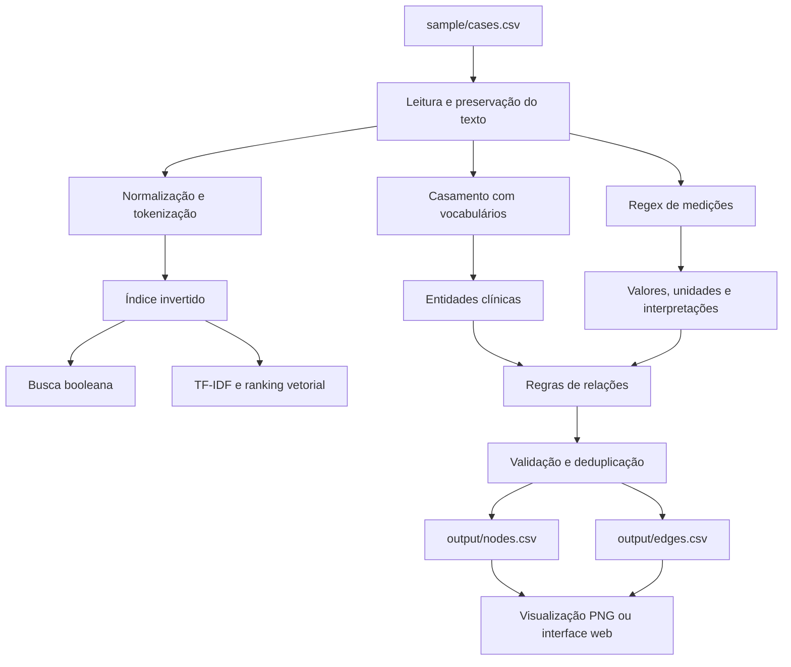
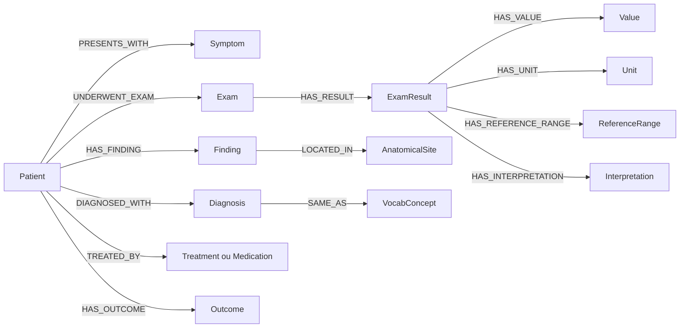

# MC896 - Projeto 1

Extração de informações clínicas do dataset **MultiCaRe** e representação como um **Knowledge Graph**.

## Estrutura

```text
.
├── sample/
│   ├── cases.csv
│   ├── metadata.csv
│   └── data_dictionary.csv
├── src/
│   ├── preprocessing/
│   ├── retrieval/
│   ├── extraction/
│   ├── graph/
│   ├── vocab/
│   └── visualization/
├── output/
│   ├── nodes.csv
│   └── edges.csv
├── vocabularies/
├── notebooks/
├── requirements.txt
└── README.md
```

## Dados

O arquivo principal é `sample/cases.csv`. Cada linha representa um caso clínico e o campo `case_text` contém o texto a ser processado.

`metadata.csv` fornece informações adicionais sobre os artigos, incluindo termos MeSH.

## Knowledge Graph

### Nodes

| Campo        | Descrição              |
| ------------ | ---------------------- |
| `node_id`    | Identificador único    |
| `type`       | Tipo da entidade       |
| `label`      | Texto da entidade      |
| `attributes` | Informações adicionais |

Tipos principais: `Patient`, `Disease`, `Symptom`, `Exam`, `Finding`, `Treatment`, `Medication`, `Measurement`.

### Edges

| Campo        | Descrição              |
| ------------ | ---------------------- |
| `edge_id`    | Identificador único    |
| `source_id`  | Nó de origem           |
| `target_id`  | Nó de destino          |
| `relation`   | Relação entre os nós   |
| `attributes` | Informações adicionais |

Exemplos de relações: `PRESENTS_WITH`, `UNDERWENT_EXAM`, `DIAGNOSED_WITH`, `TREATED_BY`, `HAS_RESULT`, `HAS_DOSE`, `HAS_VALUE`, `HAS_UNIT`.

## Pipeline

```text
cases.csv
   ↓
Tokenização + Normalização
   ↓
Dicionários / vocabulários
   ↓
Extração de entidades + Regex
   ↓
Extração de relações por regras
   ↓
Knowledge Graph
   ↓
nodes.csv + edges.csv
```

Serão implementados **Boolean Retrieval**, **TF-IDF** e **Vector Space Model** para recuperação e ranqueamento e a extração de informações clínicas será feita utilizando métodos clássicos.

---

# Projeto Extração de Informações Clínicas e Construção de Grafo de Conhecimento
# Project Clinical Information Extraction and Knowledge Graph Construction

## Visão Geral

Este projeto foi desenvolvido para a disciplina **MC896 — Processamento de Línguas Naturais** e tem como objetivo transformar narrativas clínicas em inglês, provenientes de uma amostra do dataset MultiCaRe, em uma representação estruturada na forma de grafo de conhecimento.

A proposta combina técnicas clássicas de Processamento de Línguas Naturais (PLN), Recuperação de Informação (RI) e reconhecimento de padrões. O texto de cada caso é preservado, normalizado e tokenizado; em seguida, entidades clínicas são reconhecidas por correspondência com vocabulários controlados, medições são identificadas por expressões regulares e relações são inferidas por regras. Ao final, os nós e as arestas são exportados para arquivos CSV que podem ser analisados programaticamente ou explorados por meio das visualizações incluídas no projeto.

### Objetivos

- organizar os textos clínicos e seus metadados em uma estrutura reproduzível;
- implementar busca booleana com índice invertido e listas de postings;
- ranquear casos relevantes por TF-IDF e similaridade vetorial;
- identificar entidades, valores, unidades, intervalos de referência e interpretações clínicas;
- representar entidades e relações em um grafo de propriedades;
- exportar o grafo em um formato tabular simples e interoperável;
- oferecer visualização estática e exploração local interativa do resultado;
- manter testes automatizados para os componentes centrais do pipeline.

### Escopo da primeira entrega

O repositório trabalha com a amostra disponível em `sample/`, não com a totalidade do MultiCaRe. A entrega concentra-se em métodos clássicos e interpretáveis: normalização, tokenização, remoção de stopwords para recuperação, índice invertido, operadores booleanos, TF-IDF, similaridade vetorial, casamento por dicionário, expressões regulares e regras determinísticas de relação. O projeto não se propõe, nesta etapa, a produzir diagnóstico médico ou substituir avaliação clínica.

## Slides

O PDF da apresentação ainda não está versionado neste diretório. Quando estiver disponível, ele deverá ser colocado em `assets/slides/` e o link correspondente deverá ser acrescentado aqui.

## Organização do Projeto

A estrutura atualmente implementada é a seguinte:

```text
project1/
├── README.md                         # apresentação e documentação principal
├── LOCAL_INTERFACE.md                # instruções da interface web local
├── VISUALIZATION.md                  # instruções da visualização estática
├── pyproject.toml                    # metadados e requisito de versão do Python
├── requirements.txt                  # dependências Python
├── sample/
│   ├── cases.csv                     # textos e identificadores dos casos clínicos
│   ├── metadata.csv                  # metadados dos artigos de origem
│   └── data_dictionary.csv           # descrição dos campos da amostra
├── vocabularies/                     # termos e aliases clínicos controlados
├── src/
│   ├── preprocessing/                # leitura, normalização e tokenização
│   ├── retrieval/                    # índice invertido e busca booleana
│   ├── RankedSearch/                 # TF-IDF, modelo vetorial e ranking
│   ├── Regex/                        # extração e estruturação de medições
│   ├── extraction/                   # entidades e relações clínicas
│   ├── graph/                        # esquema, construção e exportação do grafo
│   ├── vocab/                        # carregamento dos vocabulários
│   └── visualization/                # PNG, servidor local e aplicação web
├── scripts/
│   ├── export_knowledge_graph.py     # gera nodes.csv e edges.csv
│   ├── visualize_knowledge_graph.py  # gera uma imagem PNG de um caso
│   └── serve_graph_interface.py      # inicia a interface web local
├── output/
│   ├── nodes.csv                     # nós extraídos
│   └── edges.csv                     # relações extraídas
└── tests/                             # testes automatizados do pipeline
```

Essa organização separa dados de entrada, vocabulários, código-fonte, scripts executáveis, resultados e testes. Ela segue a intenção da estrutura sugerida para a disciplina, ainda que utilize os nomes `sample/` e `output/` já consolidados na implementação em vez de renomeá-los para `data/`, pois nenhuma reorganização destrutiva foi realizada nesta atualização.

## Dados e Vocabulários

### Casos clínicos

O arquivo `sample/cases.csv` é a entrada principal do pipeline. Os campos essenciais consumidos pelo código são:

| Campo | Uso no projeto |
| --- | --- |
| `case_id` | identifica unicamente o caso e compõe os identificadores dos nós |
| `case_text` | contém a narrativa clínica usada em recuperação e extração |

O módulo de pré-processamento mantém o texto original e acrescenta três representações derivadas: texto normalizado, tokens completos e tokens de recuperação sem stopwords. A preservação do texto original é importante porque posições de caracteres e formas de superfície são usadas na extração de entidades e medições.

### Metadados

`sample/metadata.csv` reúne informações complementares dos artigos, incluindo termos MeSH. Na implementação atual, a construção do grafo parte diretamente de `cases.csv`; os metadados permanecem disponíveis para análises, enriquecimento semântico e rastreabilidade futura.

### Dicionário de dados

`sample/data_dictionary.csv` documenta os campos fornecidos pela amostra. Ele deve ser consultado antes de incluir novas colunas ou alterar qualquer etapa de leitura dos dados.

### Vocabulários controlados

Os arquivos CSV de `vocabularies/` organizam conceitos clínicos por categoria: doenças, sintomas, exames, tratamentos, medicamentos, sítios anatômicos, achados, estados, cursos clínicos, desfechos, unidades e interpretações. Cada entrada pode fornecer um termo canônico, aliases e, quando disponível, um código externo.

Durante a extração, o casamento é feito de forma insensível a maiúsculas e minúsculas e respeita limites de palavras. Quando um alias aparece no texto, o grafo utiliza o rótulo canônico e registra a origem e o código como atributos. Essa estratégia reduz variações lexicais sem perder a forma observada na narrativa.

## Metodologia

### 1. Leitura e preservação dos casos

`src/preprocessing/dataset.py` lê o CSV com `csv.DictReader`. Registros sem `case_id` ou sem `case_text` não seguem para a construção do grafo. Para os registros válidos, o texto original permanece disponível durante todo o processamento.

### 2. Normalização e tokenização

`src/preprocessing/text.py` aplica normalização Unicode NFKC, uniformiza aspas e hífens, reduz sequências de espaços e converte a cópia destinada à recuperação para letras minúsculas. A expressão de tokenização foi projetada para preservar elementos frequentes no domínio clínico, como porcentagens, números decimais, unidades compostas e palavras hifenizadas.

Exemplos de unidades e formas mantidas como tokens incluem `mg/L`, `U/L`, `92%` e `5-day`. A remoção de stopwords ocorre somente na representação usada para recuperação; números, unidades e o texto clínico original não são descartados.

```python
result = preprocess_text(case["case_text"])
tokens = result.tokens
retrieval_tokens = result.retrieval_tokens
```

### 3. Recuperação booleana

O projeto constrói um índice invertido em que cada termo aponta para uma lista ligada de ocorrências por documento. Cada posting armazena o `case_id` e a frequência local do termo. Os documentos são ordenados por uma chave numérica derivada de seu identificador, permitindo percorrer as listas de maneira determinística.

As operações disponíveis são:

- `AND`: interseção dos documentos que contêm os dois termos;
- `OR`: união dos documentos que contêm pelo menos um dos termos;
- `NOT`: complemento em relação ao universo conhecido de casos.

### 4. Recuperação ranqueada

O módulo `src/RankedSearch/` transforma os documentos e a consulta em vetores ponderados. A frequência do termo e a frequência inversa de documentos seguem as expressões:

```text
TF(t, d)  = log(1 + frequência(t, d))
IDF(t)    = log(N / df(t))
TF-IDF    = TF(t, d) × IDF(t)
```

Depois da vetorização, os documentos são normalizados e ordenados pelo produto escalar com o vetor da consulta, que corresponde à base do modelo de espaço vetorial. Consultas sem termos presentes no índice retornam uma lista vazia; por padrão, documentos com pontuação zero são omitidos.

### 5. Extração de entidades clínicas

`src/extraction/entities.py` realiza *dictionary matching* sobre os vocabulários controlados. Para cada entidade reconhecida são armazenados:

- rótulo canônico;
- tipo clínico;
- posições inicial e final no texto;
- formas de superfície encontradas;
- fonte do conceito;
- código externo, quando informado no vocabulário.

Entidades repetidas são consolidadas, mantendo todas as ocorrências encontradas. Além das entidades extraídas, cada caso recebe um nó `Patient`, que funciona como ponto de entrada para as relações clínicas daquele caso.

### 6. Extração de medições por expressões regulares

Os módulos em `src/Regex/` reconhecem valores numéricos, unidades, intervalos de referência e interpretações. O adaptador de medições transforma cada ocorrência em uma estrutura nomeada contendo texto, valor, unidade, intervalo, interpretação, posição e entidade clínica associada.

A associação considera a entidade mensurável mais próxima na mesma sentença e limita a distância entre a entidade e a medição. O tipo da unidade ajuda a restringir candidatos: unidades de tempo podem indicar duração; `mm`, `cm` e `m` podem indicar tamanho; e unidades farmacológicas podem indicar dose.

### 7. Extração de relações

`src/extraction/relations.py` aplica regras determinísticas que conectam entidades do mesmo caso. As relações cobrem histórico, sintomas, achados, exames, resultados, diagnósticos, tratamentos, medicamentos, desfechos, atributos estruturados e alinhamento com vocabulários.

As relações são deduplicadas e somente são exportadas quando os nós de origem e destino realmente existem. Essa validação evita arestas órfãs no resultado final.

### 8. Construção e exportação do grafo

`src/graph/build.py` coordena a extração de entidades, relações e medições. Os identificadores são determinísticos e combinam o `case_id` com uma versão normalizada do rótulo. O resultado é gravado por `src/graph/export.py` em dois arquivos:

- `output/nodes.csv`, com os nós e seus atributos;
- `output/edges.csv`, com origem, destino, relação e atributos.

O fluxo completo pode ser resumido assim:



## Modelo Lógico

O grafo segue um modelo de propriedades: nós possuem `node_id`, `type`, `label` e `attributes`; arestas possuem `edge_id`, `source_id`, `target_id`, `relation` e `attributes`.

### Tipos de nós implementados

| Grupo | Tipos |
| --- | --- |
| núcleo do caso | `Patient`, `History` |
| manifestações clínicas | `Symptom`, `Finding` |
| investigação | `Exam`, `ExamResult` |
| diagnóstico e intervenção | `Diagnosis`, `Medication`, `Treatment` |
| evolução | `Outcome`, `Status`, `Course` |
| atributos estruturados | `Measurement`, `Value`, `Unit`, `ReferenceRange`, `Interpretation`, `AnatomicalSite` |
| interoperabilidade | `VocabConcept` |

### Famílias de relações implementadas

| Família | Relações |
| --- | --- |
| paciente e história | `HAS_HISTORY`, `PRESENTS_WITH`, `HAS_FINDING` |
| exames e evidências | `UNDERWENT_EXAM`, `HAS_RESULT`, `REVEALS`, `CONFIRMS`, `EXCLUDES`, `SUPPORTS` |
| diagnóstico e causalidade | `PREDISPOSES_TO`, `DIAGNOSED_WITH` |
| intervenção | `TREATED_BY`, `TARGETS` |
| evolução | `HAS_OUTCOME`, `LEADS_TO` |
| medidas e atributos | `HAS_DURATION`, `HAS_SIZE`, `HAS_DOSE`, `LOCATED_IN`, `HAS_VALUE`, `HAS_UNIT`, `HAS_REFERENCE_RANGE`, `HAS_LOW`, `HAS_HIGH`, `HAS_INTERPRETATION`, `HAS_STATUS`, `HAS_COURSE` |
| vocabulário | `SAME_AS` |

Uma versão conceitual simplificada do modelo é apresentada abaixo:



Para a versão final, o diagrama também pode ser exportado como PNG para `assets/images/`, conforme o modelo sugerido pela disciplina.

## Instalação

### Pré-requisitos

- Python 3.10 ou superior;
- `pip` disponível no ambiente;
- navegador moderno, apenas para a interface web local.

Na raiz de `project1`, crie e ative um ambiente virtual.

No Windows (PowerShell):

```powershell
python -m venv .venv
.\.venv\Scripts\Activate.ps1
python -m pip install --upgrade pip
python -m pip install -r requirements.txt
```

No Linux ou macOS:

```bash
python3 -m venv .venv
source .venv/bin/activate
python -m pip install --upgrade pip
python -m pip install -r requirements.txt
```

As dependências declaradas incluem Pandas, NumPy, scikit-learn, NetworkX, Matplotlib e pytest. O servidor da interface local utiliza a biblioteca padrão do Python e a visualização no navegador usa HTML, CSS, JavaScript e SVG, sem exigir um framework web adicional.

## Execução

Todos os comandos abaixo devem ser executados na raiz de `project1`.

### Gerar o grafo

```bash
python scripts/export_knowledge_graph.py
```

O script lê `sample/cases.csv`, carrega os arquivos de `vocabularies/` e atualiza `output/nodes.csv` e `output/edges.csv`.

### Gerar uma visualização PNG

Para visualizar o primeiro caso disponível:

```bash
python scripts/visualize_knowledge_graph.py
```

Para selecionar um caso e um arquivo de saída:

```bash
python scripts/visualize_knowledge_graph.py --case-id PMC5137649_01 --output output/case_graph.png
```

Os tipos de nós são diferenciados por cor e as arestas exibem os nomes das relações. Consulte também `VISUALIZATION.md`.

### Abrir a interface web local

```bash
python scripts/serve_graph_interface.py
```

Depois, acesse `http://127.0.0.1:8000`. A página permite selecionar um `case_id`, visualizar nós por tipo e mostrar ou ocultar rótulos das relações. Uma porta diferente pode ser informada com `--port`:

```bash
python scripts/serve_graph_interface.py --port 8080
```

Para encerrar o servidor, pressione `Ctrl+C`. Consulte também `LOCAL_INTERFACE.md`.

### Executar os testes

```bash
python -m pytest
```

Os testes em `tests/` cobrem pré-processamento, entidades, relações, regras de relação, esquema, construção do grafo, medições, busca ranqueada, visualização e interface web. Existe ainda um teste específico do carregamento de vocabulários em `src/vocab/test_vocabulary.py`.

## Trabalhos Estudados

O trabalho central é o artigo de apresentação do MultiCaRe, que descreve a aquisição, a organização e o pré-processamento de um conjunto multimodal de relatos de caso de acesso aberto publicados no PubMed Central entre 1990 e 2023. Neste projeto, utiliza-se apenas uma amostra textual desse universo para investigar a passagem de narrativas clínicas não estruturadas para um grafo consultável.

Também foi considerada a proposta do Cookiecutter Data Science como referência de organização de projetos. A separação entre dados, código, processos, artefatos e documentação favorece reprodutibilidade, revisão e evolução incremental, princípios refletidos na divisão atual entre `sample/`, `src/`, `scripts/`, `output/` e `tests/`.

## Análises que Podem ser Realizadas

O grafo produzido permite formular perguntas que seriam trabalhosas diretamente sobre texto livre. Entre as possibilidades estão:

- identificar sintomas, achados e exames mais associados a cada diagnóstico;
- comparar tratamentos utilizados em casos com desfechos distintos;
- localizar valores laboratoriais, unidades e interpretações ligados a exames específicos;
- investigar quais achados apoiam, confirmam ou excluem diagnósticos;
- observar sequências entre predisposição, diagnóstico, tratamento e desfecho;
- contabilizar entidades e relações por caso, tipo clínico ou artigo de origem;
- detectar componentes desconectados, nós isolados ou relações incompletas como parte do controle de qualidade;
- usar busca booleana para formar subconjuntos de casos e o ranking TF-IDF para priorizar os mais relevantes;
- comparar consultas textuais com a vizinhança das entidades correspondentes no grafo;
- avaliar cobertura dos vocabulários pela proporção de menções reconhecidas e não reconhecidas.

Essas análises são exploratórias. As relações são inferidas por proximidade e regras linguísticas, portanto uma conexão no grafo representa a saída do método, e não uma afirmação médica validada.

## Ferramentas

| Ferramenta ou tecnologia | Papel no projeto |
| --- | --- |
| Python 3.10+ | implementação do pipeline e dos scripts |
| biblioteca padrão (`csv`, `re`, `unicodedata`, `dataclasses`) | leitura, normalização, expressões regulares e estruturas de dados |
| NumPy | operações vetoriais do ranking |
| Pandas | suporte à manipulação tabular |
| scikit-learn | dependência disponível para métodos de RI e PLN |
| NetworkX | montagem e análise da representação em rede para visualização |
| Matplotlib | geração da visualização estática em PNG |
| HTML, CSS, JavaScript e SVG | interface web local e renderização interativa |
| pytest | testes automatizados |
| CSV | intercâmbio simples dos dados de entrada e do grafo exportado |

A escolha por métodos clássicos torna as decisões mais auditáveis: termos reconhecidos podem ser rastreados aos vocabulários, medições às expressões regulares e relações às regras que as produziram. Como contrapartida, o desempenho depende da cobertura lexical e da variedade de construções previstas manualmente.

## Resultados

O estado atual do repositório inclui os dois artefatos de grafo esperados, `output/nodes.csv` e `output/edges.csv`, além dos mecanismos para regenerá-los a partir da amostra. O resultado materializa:

- entidades clínicas normalizadas como nós;
- atributos de proveniência e código quando fornecidos pelo vocabulário;
- valores, unidades, intervalos e interpretações como componentes explícitos;
- relações clínicas e relações de atributos entre os nós;
- identificadores determinísticos por caso;
- filtragem de arestas inválidas e deduplicação das relações;
- visualização estática de um caso e navegação interativa local.

Os resultados devem ser interpretados considerando as limitações do método. Casamento por dicionário pode perder sinônimos ausentes ou gerar ambiguidades; regras de proximidade não resolvem toda a sintaxe clínica; negação, temporalidade e correferência podem exigir tratamento adicional; e uma amostra não representa necessariamente toda a diversidade do MultiCaRe. Uma avaliação quantitativa futura deve comparar uma amostra anotada manualmente com a extração e reportar precisão, revocação e F1 por tipo de entidade e relação.

## Como Modelos de Linguagem Foram Usados

O pipeline executável documentado neste repositório não depende de modelos de linguagem generativos: a recuperação e a extração são implementadas com métodos clássicos, vocabulários, expressões regulares e regras.

Não há, nos arquivos do projeto, um registro consolidado que permita atribuir com segurança usos de modelos de linguagem durante planejamento, programação, revisão ou redação. Caso tenham sido utilizados, a equipe deve completar esta seção antes da entrega, informando de maneira transparente:

- qual ferramenta e versão foram usadas;
- em quais tarefas houve assistência;
- quais partes foram verificadas ou modificadas pela equipe;
- quais limitações ou erros foram encontrados;
- se dados clínicos foram enviados a algum serviço externo.

Independentemente da ferramenta, toda sugestão gerada deve ser revisada pelos autores, e dados sensíveis não devem ser compartilhados com serviços externos sem base legal, autorização e medidas adequadas de proteção.

## Limitações e Próximos Passos

- ampliar e revisar os vocabulários controlados;
- incorporar explicitamente os metadados e termos MeSH ao grafo;
- avaliar entidades e relações contra um conjunto de referência anotado;
- aprofundar o tratamento de negação, incerteza, temporalidade e correferência;
- separar dados brutos, intermediários e processados conforme a estrutura completa sugerida pela disciplina, caso a equipe aprove essa migração;
- produzir o PNG definitivo do modelo lógico em `assets/images/`;
- adicionar o PDF e o link dos slides em `assets/slides/`;
- registrar métricas quantitativas e exemplos comentados na versão final do relatório;
- documentar autoria, integrantes da equipe e responsabilidades, caso exigidos na entrega.

## Referências Bibliográficas

1. NIEVAS OFFIDANI, Mauro Andrés; DELRIEUX, Claudio Augusto. *Dataset of clinical cases, images, image labels and captions from open access case reports from PubMed Central (1990–2023).* Data in Brief, v. 52, art. 110008, 2024. DOI: [10.1016/j.dib.2023.110008](https://doi.org/10.1016/j.dib.2023.110008).
2. NIEVAS OFFIDANI, Mauro Andrés; DELRIEUX, Claudio Augusto. *The MultiCaRe Dataset: A Multimodal Case Report Dataset with Clinical Cases, Labeled Images and Captions from Open Access PMC Articles.* Zenodo, 2023. DOI: [10.5281/zenodo.10079370](https://doi.org/10.5281/zenodo.10079370).
3. DRIVENDATA. *Cookiecutter Data Science.* Disponível em: [https://cookiecutter-data-science.drivendata.org/](https://cookiecutter-data-science.drivendata.org/). Acesso em: 14 set. 2026.
